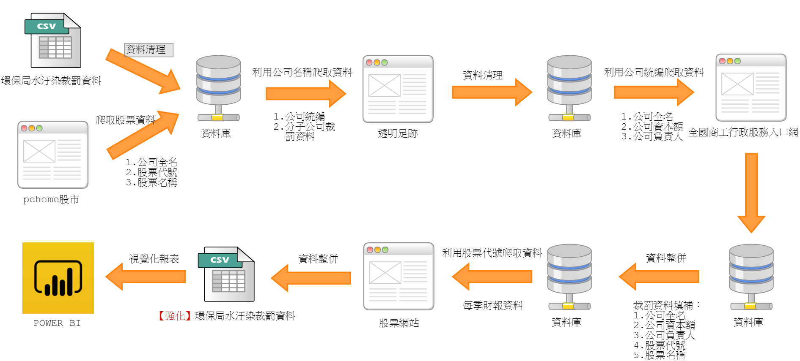

# D4SG_新竹縣環保局-便利資訊看板

<iframe src="https://goo.gl/81wqnm" width="700px" height="500px" frameborder="0" scrolling="no"> </iframe>

## 資料來源
* 行政院環境保護署 環境資源資料開放平台(https://opendata.epa.gov.tw/)
* 透明足跡(https://thaubing.gcaa.org.tw)
* 全國商工行政服務入口網(http://gcis.nat.gov.tw)
* 公司名稱&股票代號對照表(D4SG_Environmental-Protection/公司名稱&股票代號對照表.txt)
* 股票網站

## 處理步驟

