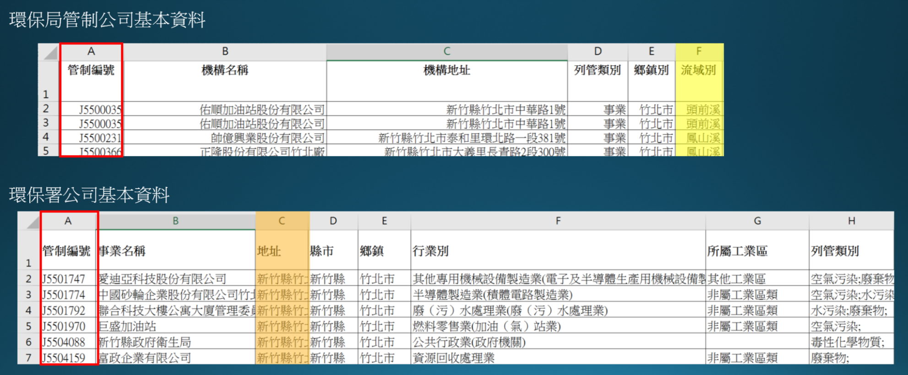
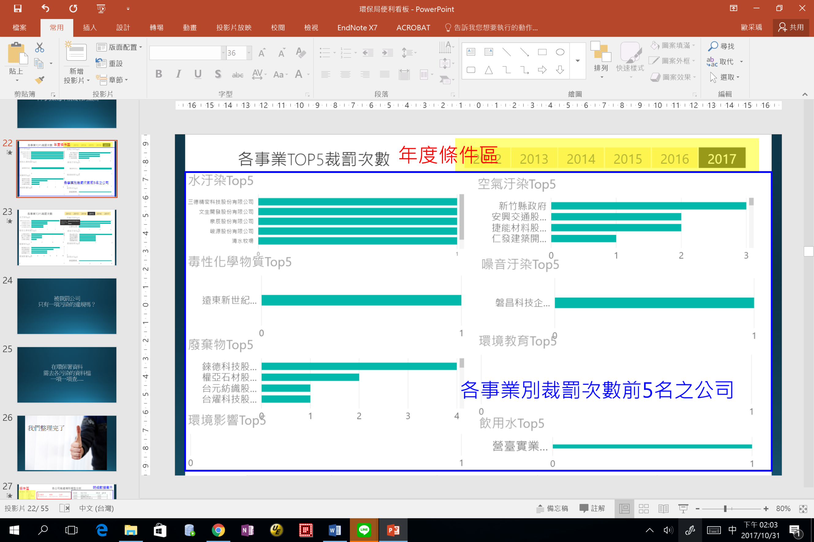
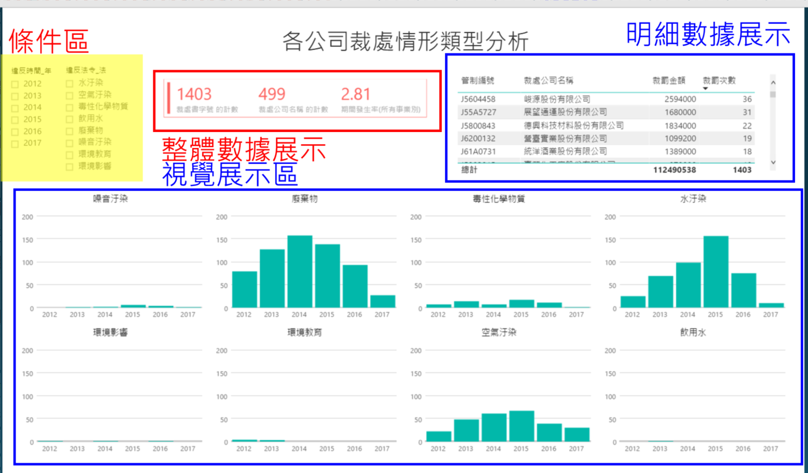
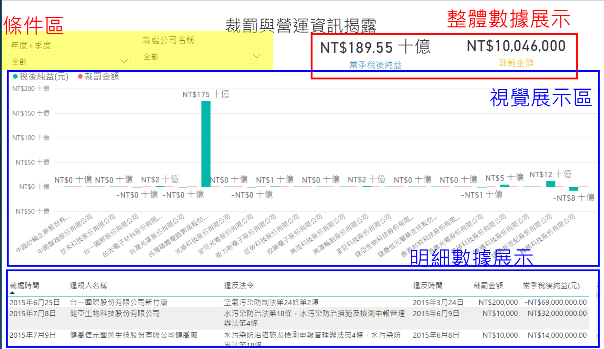
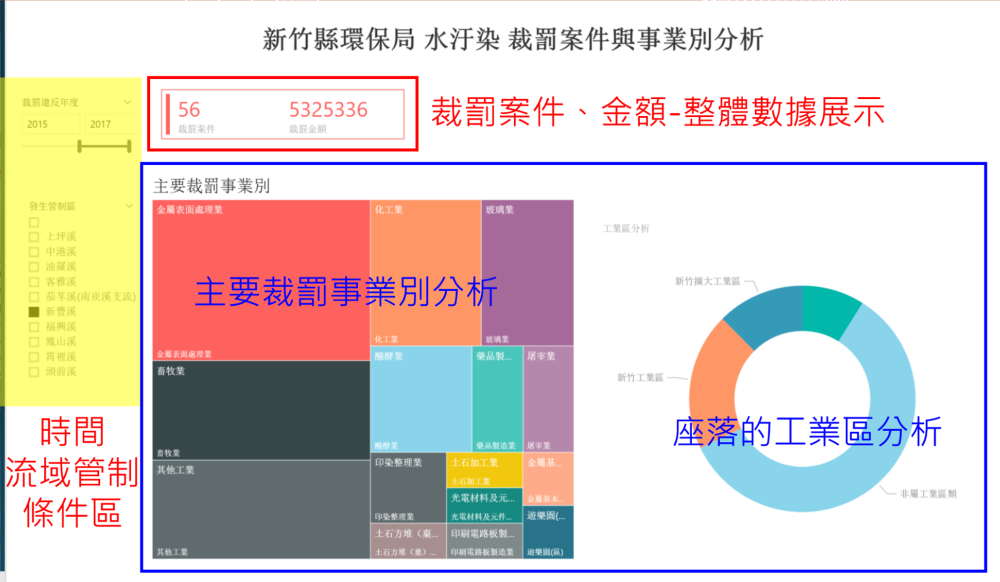
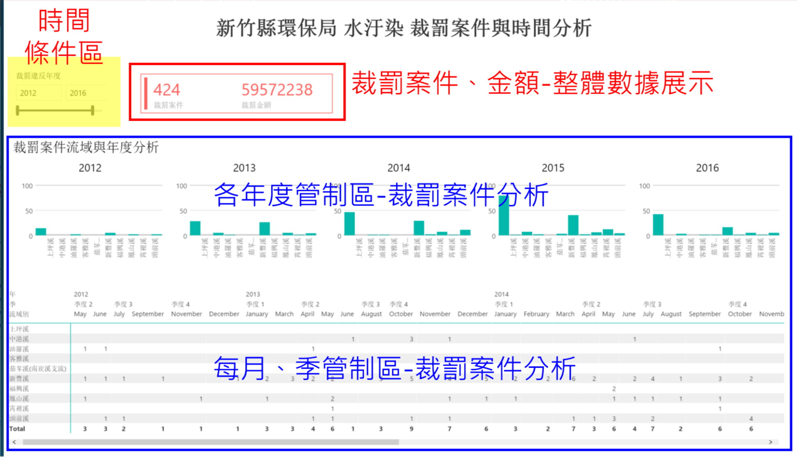
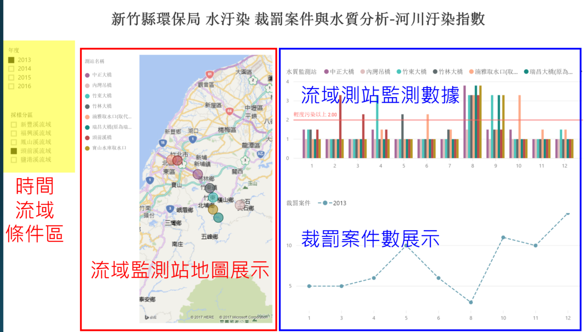
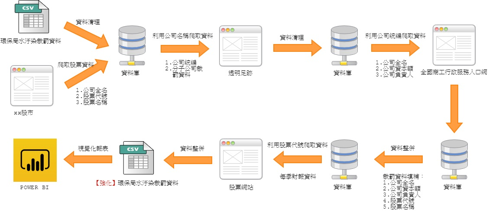
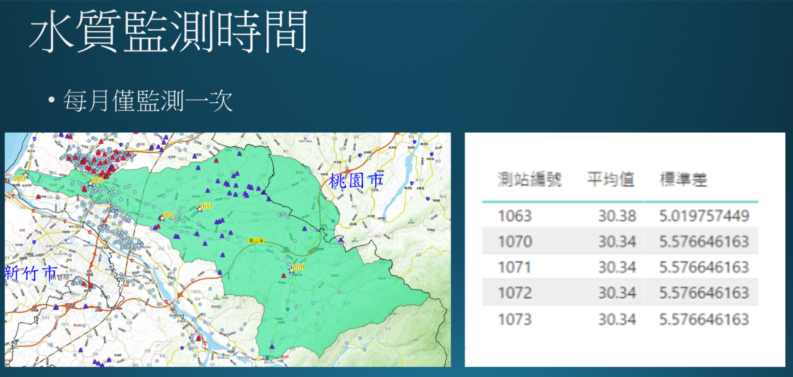

# [D4SG_新竹縣環保局-便利資訊看板](https://laimickey.github.io/D4SG_Environmental-Protection/)

## 當天簡報(https://www.slideshare.net/MickeyLai2/d4sg-81315677)
<iframe src="//www.slideshare.net/slideshow/embed_code/key/yzTbIGpzWkByHP" width="595" height="485" frameborder="0" marginwidth="0" marginheight="0" scrolling="no" style="border:1px solid #CCC; border-width:1px; margin-bottom:5px; max-width: 100%;" allowfullscreen> </iframe> <div style="margin-bottom:5px"> <strong> <a href="//www.slideshare.net/MickeyLai2/d4sg-81315677" title="【D4SG】新竹縣環保局-便利資訊看板(雛形)" target="_blank">【D4SG】新竹縣環保局-便利資訊看板(雛形)</a> </strong> from <strong><a href="https://www.slideshare.net/MickeyLai2" target="_blank">Mickey Lai</a></strong> </div>

## Power BI(https://goo.gl/81wqnm)

### 使用經驗分享：<a href="https://laimickey.github.io/D4SG_Environmental-Protection/PowerBIGeneralTips" title="Title" target="view_window">PowerBIGeneralTips.md</a>

<iframe width="1024" height="768" src="https://goo.gl/81wqnm" frameborder="0" allowfullscreen></iframe>

## 資料來源
* 新竹縣政府環保局，提供內部資料：管制公司
* 行政院環境保護署，環境資源資料開放平台(https://opendata.epa.gov.tw/)：下載新竹縣相關資料：基本資料、裁處資料、河川管制區、河川水質監控數據
* 透明足跡(https://thaubing.gcaa.org.tw)
* 全國商工行政服務入口網(http://gcis.nat.gov.tw)
* 公司名稱&股票代號對照表(D4SG_Environmental-Protection/公司名稱&股票代號對照表.txt)
* 股票網站

## 系統構想

<p>甲、 由於環保署提供之基本資料較為詳細，如下圖所示，因此，首先篩選列管類別為水汙染之公司，藉由管制編號視為key值，將環保局內部資料之流域別進行join整合，賦予每一家管制公司排放汙水之流域別，並進行地址對位geocoding。</p>
  
<p></p>

<p>乙、我們設計<b><span style='color:red'>以局處整體的角度思考設計三個頁面</span></b>，瞭解局處內部之裁處情形以及各公司裁處狀況。</p>

<p>&nbsp;&nbsp;&nbsp;&nbsp;&nbsp;&nbsp;&nbsp;&nbsp;
i.&nbsp;
各事業別TOP5裁罰公司</p>

<p>&nbsp;&nbsp;&nbsp;&nbsp;&nbsp;&nbsp;&nbsp;&nbsp;&nbsp;&nbsp;&nbsp;&nbsp;以各科室之管制事業進行統計，計算出該時間點發生裁處事實之前五名公司，藉此督促相關單位進行監督。</p>

<p></p>

<p>&nbsp;&nbsp;&nbsp;&nbsp;&nbsp;&nbsp;&nbsp;&nbsp;
ii.&nbsp;
各公司裁處情形類型分析</p>

<p>&nbsp;&nbsp;&nbsp;&nbsp;&nbsp;&nbsp;&nbsp;&nbsp;&nbsp;&nbsp;&nbsp;&nbsp;同一間公司當發生水汙然時亦有可能同時伴隨空氣汙染，此介面希望關聯各科室間的橫向溝通，當一單位發生空氣汙染時，可立即協調另一單位進行訪視。</p>

<p></p>

<p>&nbsp;&nbsp;&nbsp;&nbsp;&nbsp;&nbsp;&nbsp;&nbsp;
iii.&nbsp;
財罰與營運資訊揭露</p>

<p>&nbsp;&nbsp;&nbsp;&nbsp;&nbsp;&nbsp;&nbsp;&nbsp;&nbsp;&nbsp;&nbsp;&nbsp;與外部網站整合取得各公司當季稅純益資訊，希望藉由此數據瞭解裁罰金額與利潤之關係，部分企業對於裁罰情形不痛不癢，藉由此部分希望省思裁罰金額與企業責任之道德觀。</p>

<p></p>

<p>丙、 <span style='font-family:"新細明體",serif;color:red'>水汙染為本專案之重點</span>，由於不同河川有其所屬流域和管制範圍，河川水體本身亦有不同等級，因此對於每一個管制流域探討其常發生裁處之公司事業類別，以及裁處事實之時間分析和河川水質情形，一共設計三種頁面，其中河川水質情形可有不同的水質檢測項目進行探討。</p>

<p>&nbsp;&nbsp;&nbsp;&nbsp;&nbsp;&nbsp;&nbsp;&nbsp;
i.&nbsp;
水汙染裁罰案件與事業別分析</p>

<p>&nbsp;&nbsp;&nbsp;&nbsp;&nbsp;&nbsp;&nbsp;&nbsp;&nbsp;&nbsp;&nbsp;&nbsp;依據公司坐落位置和水汙染排放之流域進行分析，以視覺化方式呈現不同流域常發生裁罰事實之事業別和座落位置，以強化稽查效率。</p>

<p></p>

<p>&nbsp;&nbsp;&nbsp;&nbsp;&nbsp;&nbsp;&nbsp;&nbsp;
ii.&nbsp;
水汙染裁罰案件與時間分析</p>

<p>&nbsp;&nbsp;&nbsp;&nbsp;&nbsp;&nbsp;&nbsp;&nbsp;&nbsp;&nbsp;&nbsp;&nbsp;以視覺化方式呈現各流域在不同時間點之裁處數據和月份分析，將稽查重點放在過去常發生之裁處地區和月份，提升稽查人員之效率。</p>

<p></p>

<p>&nbsp;&nbsp;&nbsp;&nbsp;&nbsp;&nbsp;&nbsp;&nbsp;
iii.&nbsp;
裁罰案件與水質分析</p>

<p>&nbsp;&nbsp;&nbsp;&nbsp;&nbsp;&nbsp;&nbsp;&nbsp;&nbsp;&nbsp;&nbsp;&nbsp;由於不同流域之河川水體等級不同，以及流域中對於水汙染排放後指數之敏感度不同，因此，此頁面以地圖搭配監測點的方式呈現，由內部具有水質高度敏感度之人員，藉由水質波動數據觀察是否有裁處的情形，從上中下游數據之觀察，以及不同流域常發生裁處事實之事業別應該觀測那些水質數據。</p>

<p></p>


## 資料處理步驟(爬網時請控制程式執行頻率，不要影響目標網站正常營運!!!)


### Step1. 處理好環保署開放資料後，取出公司名稱，至透明足跡爬取相關資訊(Use R)

```r
library(RODBC)
library(httr)

regexp <- function(pattern, data, idx=1L, is.split=FALSE, spt=NULL) {
  text <- data[idx]
  v <- regexpr(pattern, text)
  n <- unlist(lapply(strsplit(pattern, "\\.\\+"), nchar))
  out <- substr(text, v + n[1], v + attr(v,"match.length") - (n[2]+1))
  if (is.split) unlist(strsplit(out, spt)) else out
} # end regexp()


## 組出爬網URL
url_front <- "https://thaubing.gcaa.org.tw/envmap?facility_name=&corp_id=&industry_name=All&poltype=All&factory_fine=1&id_2=All&page=0&qt-front_content=1&facility_name="
url_end <- "&corp_id=&industry_name=All&poltype=All&factory_fine=1&id_2=All"
get_url <- paste0(url_front, "峻源股份有限公司", url_end)


## 至透明足跡爬取資料=>先取得該公司在透明足跡網址
html <- GET(get_url)
web_content <- content(html, "text", encoding = "UTF-8")

target_path <- regexp(paste0('<div class=\"views-field views-field-facility-name factory-name\"><span class=\"field-content\"><a href=\".+\">', "峻源股份有限公司", '</a>'), web_content)

print(target_path)
```

<pre><code>## [1] "/facility/J5604458"</code></pre>

```r
dns <- "https://thaubing.gcaa.org.tw"
target_url <- paste0(dns, target_path)

## 開始針對目標公司爬取資料
tmp <- read_html(target_url, encoding = "UTF-8")
  
web_content <- tmp %>% html_nodes('.views-field-corp-id')
corp_id <- web_content %>% html_nodes('a') %>% html_text()
  
web_content <- tmp %>% html_nodes('.views-field-facility-name')
corp_name <- web_content %>% html_nodes('.field-content') %>% html_text()
  
web_content <- tmp %>% html_nodes('.views-field-facility-address')
address <- web_content %>% html_nodes('.field-content') %>% html_text()

web_content <- tmp %>% html_nodes('.views-field-industry-area-name')
industry_area <- web_content %>% html_nodes('.field-content') %>% html_text()
  
web_content <- tmp %>% html_nodes('.views-field-industry-name')
industry <- web_content %>% html_nodes('.field-content') %>% html_text()
  
web_content <- tmp %>% html_nodes('.views-field-poltype')
apply_type <- web_content %>% html_nodes('.field-content') %>% html_text()
  
web_content <- tmp %>% html_nodes('.views-field-updatetime')
snap_date <- web_content %>% html_nodes('.field-content') %>% html_text()

print(paste0('公司統編:', corp_id, ';公司名稱:', corp_name, ';公司地址:', address))
```

<pre><code>## [1] &quot;公司統編:27873415;公司名稱:峻源股份有限公司;公司地址:新竹縣關西鎮南新里新城１之１、１之７號&quot;</code></pre>

### Step2. 利用自透明足跡爬取之公司統編，至政府資料開放平台爬取公司完整資訊(Use R)
##### 註:政府資料開放平台有提供API介接申請，有需要大量爬取資料者記得事先申請~~

```r
library(jsonlite)

URL <- paste("http://data.gcis.nat.gov.tw/od/data/api/5F64D864-61CB-4D0D-8AD9-492047CC1EA6?$format=json&$filter=Business_Accounting_NO%20eq%20", corp_id, sep="")
corp_content <- readLines(URL, encoding = "UTF-8")
```

<pre><code>## Warning in readLines(URL, encoding = &quot;UTF-8&quot;): 於 'http://
## data.gcis.nat.gov.tw/od/data/api/5F64D864-61CB-4D0D-8AD9-492047CC1EA6?
## $format=json&amp;$filter=Business_Accounting_NO%20eq%2027873415' 找到不完整的最
## 後一列</code></pre>

```r
df <- fromJSON(corp_content)
print(df)
```

<pre><code>##   Business_Accounting_NO Company_Status_Desc     Company_Name
## 1               27873415            核准設立 峻源股份有限公司
##   Capital_Stock_Amount Paid_In_Capital_Amount Responsible_Name
## 1             75550000               75550000            喻O芫
##                  Company_Location Register_Organization_Desc
## 1 新竹縣關西鎮南新里9鄰新城1之1號           經濟部中部辦公室
##   Company_Setup_Date Change_Of_Approval_Data Revoke_App_Date Case_Status
## 1            0940819                 1061026                            
##   Case_Status_Desc Sus_App_Date Sus_Beg_Date Sus_End_Date
## 1</code></pre>
##### 註：Capital_Stock_Amount：資本總額(元)；Paid_In_Capital_Amount：實收資本額(元)

### Step3. 利用公司完整名稱整併"公司名稱&股票代號對照表.txt"，取得公司統編後，至股票網站爬取財報資訊(Use Python)
此部分需透過Selenium套件實現，完整程式碼請參考"stock_scrawler.py"

#### 準備事項
在開始使用python爬蟲前，要先安裝好下列相關套件及WebDriver。
```bash
pip3 install selenium pandas
# for MacOS
brew install geckodriver
```
> [Selenium](http://www.seleniumhq.org/) 為瀏覽器的自動化工具，可以自動化模擬瀏覽器進行動作，多用於直接操作瀏覽器進行自動化測試，此次藉由瀏覽器操作抓取股票網站的資料。

> [Pandas](https://pandas.pydata.org/index.html) 為處理數據資料的套件，擅長處理一維數據及二維的表格數據, 可以直接讀取多種格式(HTML, csv, excel, json...)，轉換乘DataFrame，進行資料處理。

#### 開始爬蟲
```python
from selenium import webdriver
import pandas as pd

driver = webdriver.Firefox()      # Open the Firefox browser
driver.set_page_load_timeout(10)  # Set the longest loading time for each page

# Read 公司名稱&股票代號對照表.txt
with open('./stock_list.txt', 'r') as fin:
    company_code_list = fin.read().split("\n")
    for company_code in company_code_list:
        # Assign the URL of target page to url variable
        url = "http://www.cmoney.tw/finance/f00041.aspx?s=" \
        + company_code.strip()
        # Let browser GET the page
        driver.get(url)
        # Use css selector to get the elements whose class is "tb-out"
        table = driver.find_element_by_css_selector(".tb-out")
        # Use pandas to read table and convert it to DataFrame
        df = pd.read_html(table.get_attribute('innerHTML'))
        # Write out the DataFrame as csv file to stock_table/ folder
        df[0].to_csv('stock_table/'+company_code+'.csv', index=False)
```
程式執行完成後，即可以在./stock_table看見如下的許多爬取資料的csv檔案
.
|____1102.csv
|____1402.csv
...
|____8150.csv
|____8421.csv


## 資料限制和建議

<p>
i.&nbsp;
環保署基本資料提供地址資料，建議可開放內部已完成geocoding之坐標資料，並加上流域別欄位讓使用者利於辨識使用。</p>

<p>
ii.&nbsp;
水質數據為每月僅監測一次且檢測時間間格為30天一次，對於意圖排放汙水之企業並無實質監控效果，且當樣本數多時，水質數據對於監測情形才有顯著幫助。</p>

<p></p>

<p>
iii.&nbsp;
現有水質監測點以河川支流中心點與出海口為主，無法有效掌握即時廢水排放情形，未來應增加即時監控設備才有助於嚇阻企業之汙水排放。</p>


## 慶功宴

<p></p>
<p></p>
<p></p>
<p></p>
